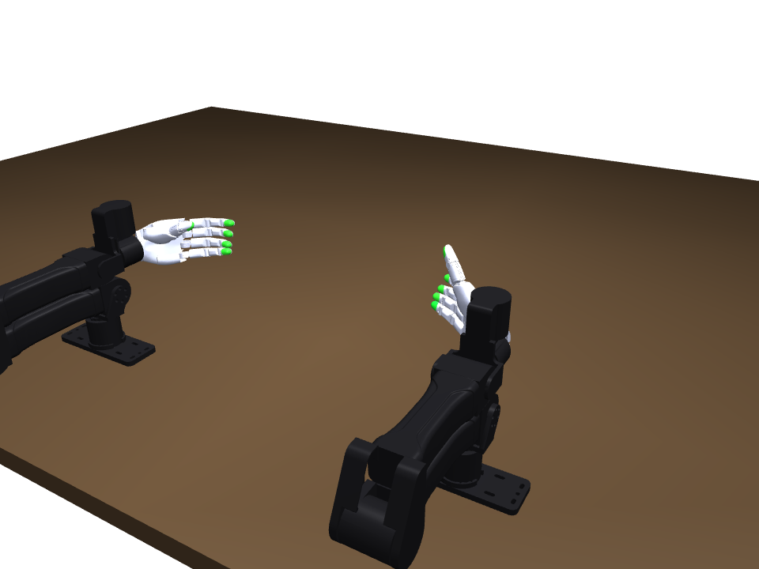
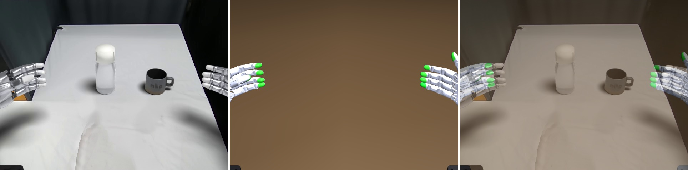

# sim_setup — the bench: two YAM arms, two sharpa hands, an empty table

This folder is the **rig and camera setup** behind
`experiments/08-14-2026/bottle/results/inpainting_bottle.gif`, extracted as a
standalone MuJoCo scene **with nothing on the table**. Same table, same two YAM
mounts, same hands, same home pose, same lens — the bottle and the mug are
simply not built.



It is self-contained: `bench_scene.xml` plus the arm and hand meshes under
`assets/`. It needs `mujoco>=3.4` and `numpy` (and `imageio` to write the
reference images); nothing else in this repo.

```
python render_bench.py          # writes reference/*.png
```

---

## 1. The rig frame

Every number below is in the **rig frame**, which is the frame the real bench
is laid out in:

```
origin   the midpoint of the two YAM base plates, ON the tabletop
  +x     toward the RIGHT base
  +y     into the work (away from the operator)
  +z     up          tabletop is exactly z = 0
```

```
                      y  (into the work)
                      ^
       .--------------|--------------.        table, 3.6 m x 2.15 m
       |              |              |        top at z = 0
       |              |              |
       |         look_at (0, 0.425)  |
       |              *              |
       |   [L hand]       [R hand]   |        home hands, 139-285 mm up
       |      o              o       |
  -----+------#------+-------#-------+-----   y = 0 : THE BASE LINE
       |  left base      right base  |        (-0.38,0,0) and (+0.38,0,0)
       '--------------|--------------'        table near edge y = -0.30
                      |
                 bench_cam  (0, -0.521, +0.684), 35.87 deg down
```

The pipeline's own world is anchored to the source clip's camera and gravity,
so its x/y are yawed and its tabletop sits at z = -0.3623. `rig.json` carries
the exact conversion (`rig_frame.from_pipeline_world`: rotate -9.155° about z,
then translate +0.3623 in z). The scene here is that world rigidly moved —
verified geom-for-geom: **81 / 81 geoms agree to 0.28 µm and 0.000 m°**, and a
1 s servo hold drifts identically (18.70 mm in both).

## 2. The arms

| | |
|---|---|
| model | YAM, 6 DOF per side (`assets/yam`) |
| count | 2, bolted at table level |
| base positions | `(+0.38, 0, 0)` right, `(-0.38, 0, 0)` left — **0.76 m apart** |
| base yaw | both turned **+90°** so the folded arms face the work (180° about z in the rig frame) |
| base forward | **0.00 m** — the mounts sit ON the base line. (The canonical bench mounts them at -0.35; this scene slid both forward by 0.35 m so the arms could reach the work.) |
| reach | 0.74 m, shoulder to flange |
| joint limits | j1 [-2.618, 3.054], j2 [0, 3.142], j3 [0, 3.142], j4 [±1.571], j5 [±1.571], j6 [±2.094] rad |

**The hand is a separate 20-DOF sharpa hand** (`assets/sharpa`), attached to the
arm's gripper flange by a **position-only weld** (`equality/weld … torquescale=0`).
That is the single most important thing to know about this rig:

> the arm carries the hand's **position** and never its **orientation**.
> The hand's own six wrist DOFs (`{side}_{side}_pos_{xyz}` / `rot_{xyz}`) hold
> the orientation, and driving the arm joints alone does **not** move the hand.

Two consequences that bite:
* setting the arm joints to zero leaves the hands wherever their wrist DOFs
  say — you must write the wrist pose too (that is what the `home` keyframe
  does);
* the weld is compliant, so the home pose is a **commanded** state, not an
  equilibrium: hold it under gravity for one second and the palms sag 18.7 mm.
  Replay commanded states (`mj_forward`), the way the delivered videos do.

## 3. The home pose — `keyframe "home"`

Frame 0 of the delivered run (`results/bottle_task_qpos.npz`): **both arms at
all-zero joints**, arms folded flat along their base plates, hands raised and
palms up. This is the rig's start and end state for every task.

| | right | left |
|---|---|---|
| arm joints (rad) | all 0 (|q| < 4e-4) | all 0 (|q| < 4e-4) |
| wrist position (rig, m) | (+0.380, 0.111, 0.173) | (-0.380, 0.111, 0.173) |
| wrist euler XYZ (rad) | (-1.575, -0.780, -3.072) | (-1.577, +0.609, -0.098) |
| hand geometry above the table | 140 – 285 mm | 139 – 236 mm |

```python
mujoco.mj_resetDataKeyframe(model, data, model.key("home").id)
```

Because the hands are 139 mm up at home, **an object lying on the table can
never touch them however close it comes in xy** — the near-side clearance
check is about the delivery picture, not about collision.

## 4. The table

Static box, half-extents `1.8 x 1.075 x 0.02` m, centre `(0, 0.775, -0.02)`:

* top surface exactly **z = 0**
* spans rig **x ∈ [-1.80, +1.80]**, **y ∈ [-0.30, +1.85]**
* the **near edge is at y = -0.30**, i.e. 0.30 m in front of the base line —
  "behind the mounts" is still table, but not much of it.

Hand↔table contact pairs are declared explicitly (the hand asset ships with
every contact disabled). **An object attached to this scene is on nobody's
contact list**, so a hand closing on it passes straight through until you add
`<pair>` entries for it — see §7.

## 5. The cameras

### The lens — one calibration, shared by the whole photo bench

| | |
|---|---|
| resolution | 640 x 480 |
| focal | **870 px** |
| fovy | **30.844°** (= 2·atan(240/870)) |
| height above the tabletop | **0.684 m** |
| optical axis | **35.87° down** |

Fitted from the bottle clip's own metric depth — RANSAC on the visible
tabletop, 15.6k inliers at 3.7 mm rms
(`experiments/08-14-2026/bottle/results/reset_fit.json`) — and it transfers to
every clip shot on the same bench because the rig does not move.

> **It is not 736.63 px.** That focal is EgoDex's, a property of a different
> capture rig; applied to this bench it reads every distance ~18 % long (a
> 1.5 m stanchion rope comes out 1.75 m, a 216 mm gift box 27 cm).

### `bench_cam` — the lens `inpainting_bottle.gif` is rendered through

```
position (rig)  (0.000, -0.520951, 0.684)      quat (w,x,y,z) 0.890491 0.455001 0 0
looks at        (0, 0.425, 0) on the tabletop  fovy 30.844 at 640x480
```

Why *there*: the sim is **not registered to its footage and never can be** —
stage 2 moved every object to where the arms can reach it. What the sim and the
footage do share is the **table plane**. Pin the camera's *focal*, *height above
the tabletop* and *pitch* to the clip's own and the sim tabletop maps onto the
real tabletop's pixels exactly, so anything standing on it lands with the right
perspective and its contact shadow falls where a real one would. Only the
camera's **(x, y) on that plane** is left free, and it is *chosen*, not
recovered:

* **y** is solved so the rig origin projects to 1.05·H — the two mounts at the
  very bottom of frame, arms entering from below exactly where a demonstrator's
  forearms do. (Scoring "how much of the run is in shot" instead drags the lens
  backwards until the mounts and most of both arms leave the picture.)
* **x** is searched for the aim that keeps the run centred; it came out 0.

`reference/registration_check.jpg` is the receipt — *composite frame 0 | this
empty scene through `bench_cam` | 50/50 blend*. The hands land on the
composite's hands.



### `photo_bench_cam` — where the bench's own camera stood

```
position (rig)  (0.020, -0.394, 0.684)         same lens, same pitch
```

Identical optics; it differs from `bench_cam` **only in where it stands on the
table plane** (127 mm nearer the work, 20 mm to the right). Use this one to turn
that clip's pixels into metres; use `bench_cam` to reproduce the delivered
composite.

### One known offset in the delivered composite

The stage-4 exporter read the Blender camera out of `scn.camera[0]`, which is
MuJoCo's **left stereo eye** — offset by `-ipd/2 = -34 mm` laterally (default
`ipd` 0.068 m). MuJoCo's own mono render uses the midpoint of the two eyes, so
in `inpainting_bottle.mp4` the ray-traced pass sits **34 mm to the left** of the
segmentation masks it was composited against — about 2.5 px at 640x480. The
camera published here is the **true centre**; if you want to reproduce the
delivered pixels bit-for-bit, shift `bench_cam` by -0.034 m along its own right
vector.

## 6. Physics

`timestep 2.5e-4 s`, integrator `implicitfast`, `impratio 5`, gravity
`(0, 0, -9.81)`. 68 qpos, 56 position actuators (6 wrist + 20 finger + 2 x 6 arm
are driven through their own controllers upstream), 2 equality constraints (the
two arm↔hand welds), 32 hand↔table contact pairs.

`implicitfast` is not cosmetic: under MuJoCo's default explicit Euler the stiff
couplings in these scenes go non-finite within a third of a second.

## 7. Putting something on the table

Object placement is a **separate stage** from this setup, and it is deliberate
that nothing here knows about objects. To add one:

```python
import mujoco
spec  = mujoco.MjSpec.from_file("bench_scene.xml")
child = mujoco.MjSpec.from_file("my_object.xml")     # z = 0 is its footprint
frame = spec.worldbody.add_frame(pos=[0.0, 0.45, 0.0])   # rig frame, on the top
spec.attach(child, prefix="obj_", frame=frame)
# THEN declare the contacts — an attached asset is on nobody's pair list, so a
# hand closes straight through it until you add hand-geom <-> object-geom pairs.
model = spec.compile()
```

A sane target region for a two-handed task is roughly `x ∈ [-0.25, 0.25]`,
`y ∈ [0.30, 0.55]`: inside both 0.74 m envelopes, clear of the base line, and
well onto the table.

## 8. Files

```
bench_scene.xml     the scene: table + 2 YAM arms + 2 sharpa hands + 2 cameras
                    + the `home` keyframe. Nothing on the table.
rig.json            every number above, machine-readable (including the full
                    68-value home qpos and its joint order)
render_bench.py     renders reference/*.png; constants at the top, no CLI args
assets/yam/         6 STL, the YAM links
assets/sharpa/      42 STL, both hands
reference/          bench_cam_home.png, photo_bench_cam_home.png,
                    overview_home.png, registration_check.jpg,
                    inpainting_bottle_frame0.jpg
```

## 9. Provenance

Built by `agents/scenekit/builders/bottle_task.py` → `bottle_mug.build_world`
→ `scenekit/builders/stage.build_stage(world="tabletop")`, with an **empty item
list** so the bottle and the mug are never constructed. The camera is the one
stage 4 solved for that run. Table, arm mounts, hands and the first 68 qpos
slots are identical to the delivered `inpainting_bottle` run.
